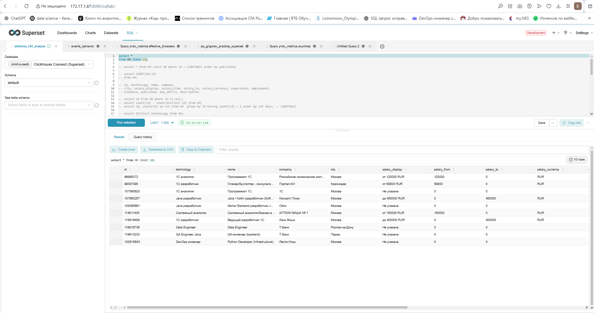
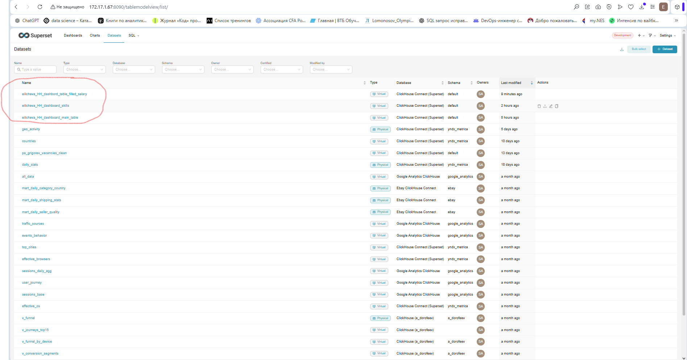
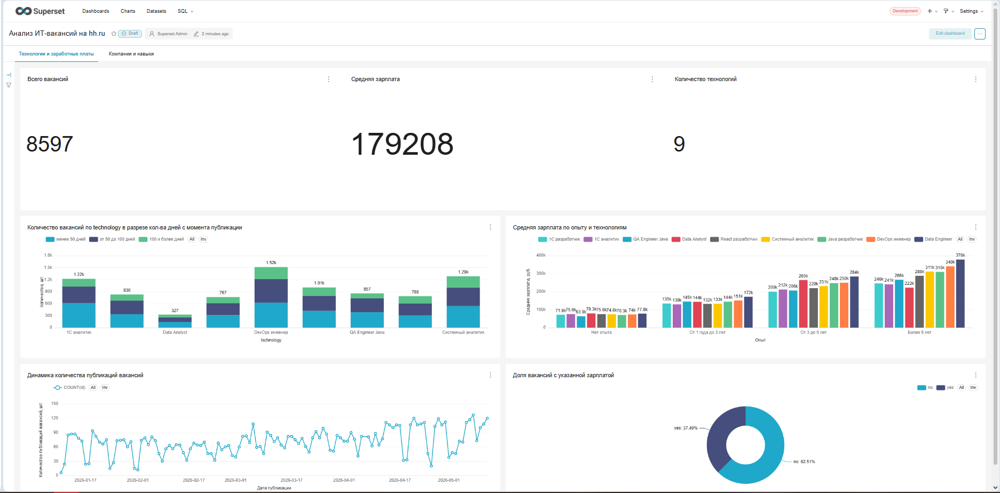
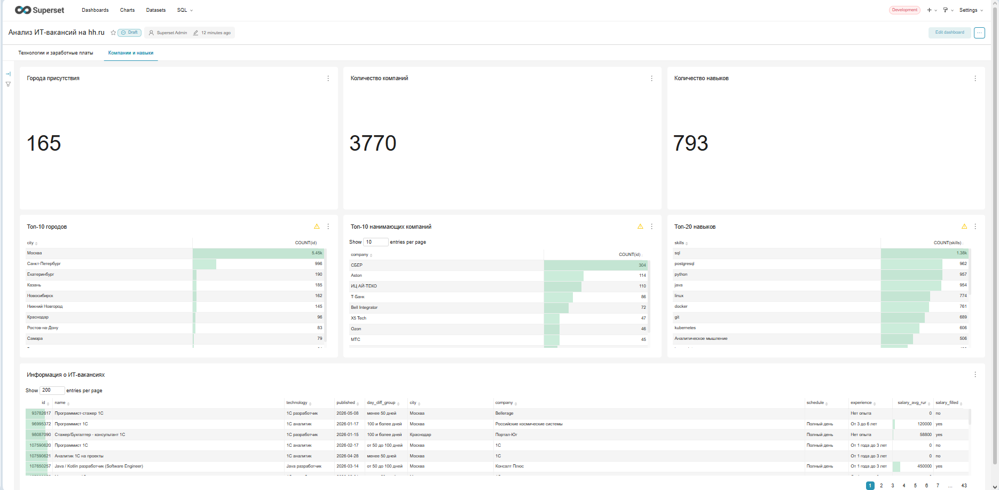

# Отчёт по Практике Superset (CBR2030)

Цель: освоение Apache Superset на примере анализа данных о вакансиях (hh.ru), хранящихся в ClickHouse. В ходе выполнения нужно пройти полный цикл работы: от исследования данных до создания полноценного дашборда с визуализацией и выводами.

## Задача 1.1 Профилирование данных через SQL Lab

Подключение к базе данных (ClickHouse) уже настроено, вам не нужно ничего дополнительно конфигурировать. Ваша задача - самостоятельно найти, как в интерфейсе Superset открыть SQL Lab и начать выполнять запросы к базе данных.
Что необходимо сделать:
Найти базу данных (таблица лежит в default)
Выполнить простые SQL-запросы, чтобы посмотреть данные
Понять структуру: какие есть поля, какие типы данных, где могут быть NULL

По результатам простых запросов Clichouse (бд default, таблица HH) определили, что таблица HH имеет 9061 строку и 16 столбцов.
Описание столбцов
`id` - id вакансии. Количество уникальных id 8597 (464 дубликата). Одна и та же вакансия может встречаться 2, 3, 4 (например, id = hf) раза; 
`technology` - в поле содержится 9 уникальных значений (наименования технологий), пропусков не обнаружено; 
`name` - название вакансии, пропусков не обнаружено; 
`company` - нанимающая комания, пропусков не обнаружено;
`city` - город, пропусков не обнаружено;
`salary_display` - диапазон зарплат по вакансии, есть значение "Не указана" (5657 строк);
`salary_from`, `salary_to` - зп от и до (5657 строк где salary_from = 0 and salary_to = 0);
`salary_currency` - валюта зп (rur, eur, usd, для 5657 строк salary_currency = '');
`experience` - опыт (нет, 1-3 года, 3-6 лет, более 6), пропусков не обнаружено;
`employment` - полная занятость/частичная занятость/проектная работа. Для 2740 строк employment = '';
`schedule` - полный день/удаленная работа/сменный график/гибкий график. Для 2740 строк schedule = '';
`published` - дата публикации вакансии, пропусков не обнаружено;
`key_skills` - скилы для вакансии. Для 3163 строк key_skills = '';
`description` - описание вакансии, пропусков не обнаружено. 

## Задача 1.2 Сбор требований (аналитика до визуализации)

Перед тем как строить графики, необходимо понять, что именно вы хотите проанализировать.
Ваша задача — спроектировать будущий дашборд:
Определите цель дашборда
Сформулируйте 3–5 вопросов, на которые должен отвечать дашборд.
В вашей работе обязательно должны быть следующие типы визуализаций: bar chart/histogram, pie chart, line chart, table. Должны быть фильтры и срезы, настройка взаимодействия графиков. Учитывайте это при проектировании требований к будущему отчету.

Цель
Провести анализ и построить дашборд, который поможет ит-специалиcту, который ищет работу  
1. выбрать подходящие вакансии, куда направить свое резюме;
2. понять какие скилы нужно подучить, чтобы стать более востребованным.

Вопросы, на которые будет отвечать дашборд:
- лист 1
     - Какие технологии/направления сейчас наиболее востребованы? График "Количество вакансий по technology" (bar chart).
     - Кому больше платят? График "Средние зарплаты по технологиям" (bar chart)
     - Насколько прозрачен рынок – какая доля вакансий с указанной зарплатой? График "Доля вакансий с указанной зарплатой" (bar chart)
     - Есть ли сезонность или динамика публикаций? График "Динамика количества публикаций" (line chart)
     - Карта по городам с указанием количества вакансий.
- лист 2
     - Какой график работы? График "Соотношение форматов работы (удалённо / гибрид / офис)" (pie chart)
     - Есть ли различия в зарплате в зависимости от формата работы? График "Фомат vs зарплата" (bar chart)
     - Какие компании активно нанимают? Таблица "Топ 10 нанимающих компании" (table)
     - Какие навыки стоит подучить, чтобы стать более востребованным?  Таблица "Топ 10 навыков" (table)
     - Облако слов для навыков.

## Задача 1.3 Подготовка данных и создание dataset
Напишите SQL-запрос, который будет основой вашего dataset
Создайте dataset для дальнейшего использования (или несколько датасетов, если вы разделили логику)

Для реализации цели дашборда в нужно:
1. Удалить дубликаты из таблицы HH по id (оставить из нескольких только строку по самой последней дате публикации);
2. В таблицу HH добавить поля:
   - курс валют, средняя заработная плата в рублях и флаг 'salary_filled';
   - группа по количеству дней с даты публикации вакансии (до 50, от 50 до 100, свыше 100);
3. Распарсить навыки по технологиям в отдельную таблицу.
Учтем это при написании SQL-запросов (см. ф. "sql_script.txt").

В superset cозданы 3 датасета:
- eilicheva_HH_dashboard_main_table -  добавление в HH дополнительных столбцов и удаление ненужных столбцов для построения дашборда
- eilicheva_HH_dashboard_skills - распарcенные навыки
- eilicheva_HH_dashbord_table_filled_salary - это eilicheva_HH_dashboard_main_table после удаления строк с незаполненной зп

## Задача 1.4 Построение визуализаций и дашборда

На основе созданного dataset необходимо построить визуализации и собрать дашборд. Минимальное кол-во вкладок на дашборде: 2
! Помните про наличие обязательных типов визуализаций, фильтров, срезов, настройку взаимодействия графиков !

## Задача 1.5 Визуальная настройка

Приведите дашборд к аккуратному виду (выравнивание, логика расположения)
Дайте понятные названия графикам и осям
Настройте отображение легенд, подписей, подсказок (tooltips), вкладок.
Используйте базовую кастомизацию (цвета, сортировки, форматирование).

 

